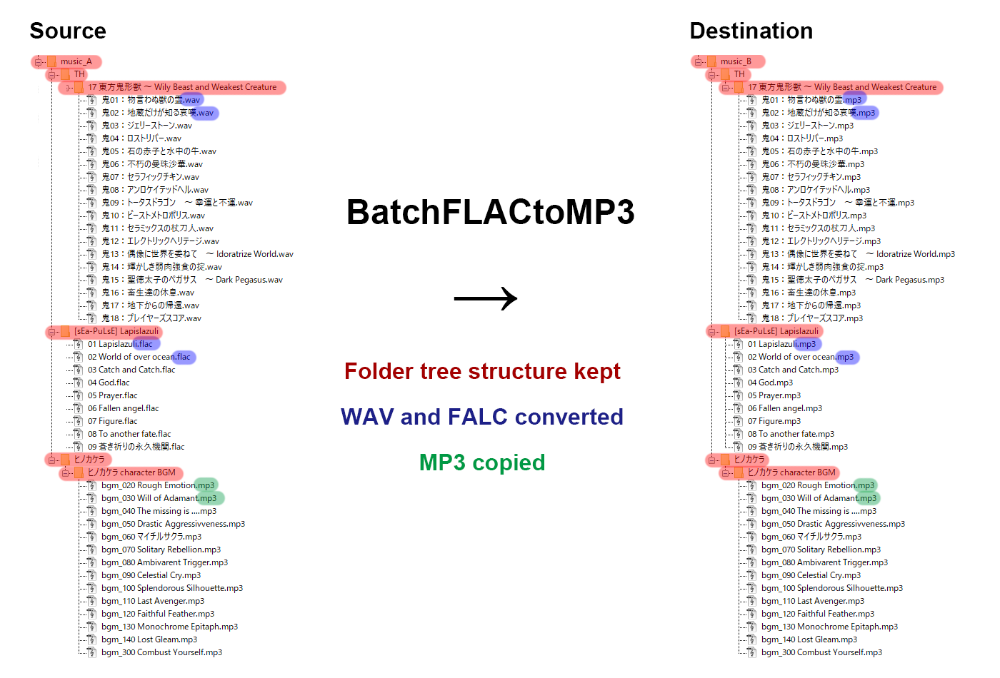

# BatchFLACtoMP3
BatchFLACtoMP3 is made up by [`pydub`](https://pydub.com/) and [`mutagen`](https://mutagen.readthedocs.io/en/latest/), pydub for converting file format and mutagen for dealing tags.

This is a script helps you batch convert **FLAC** and **WAV** files into **mp3** format and will keep the tags and cover art[^1]. The same folder tree structure will be kept in output folder as origin. Mp3 files in the original folder will also be copied to the new folder without converting.

# How to use
## CLI command: using BatchFLACtoMP3.py
```
$ python BatchFLACtoMP3.py <path of source> <path of destination> -f <option:format> -b <option:bitrate>
```
### Options
| short | long | descripttion |
| - | - | - |
| -f | --format | File format of output files. Default mp3. Other formats not guaranteed to work. [^2]|
| -b | --bitrate | Bitrate of output files. Default 320K.|

If you want to convert FLAC and WAV files contained in directory ./music_A to directory ./music_B in 192Kbps mp3, just do:

```
$ python BatchFLACtoMP3.py ./music_A ./music_B -f mp3 -b 192K
```

## Jupyter Notebook / iPython: using BatchFLACtoMP3.ipynb
Just modify parameters in the file before execute:
```
path_src    = './music_A'  # path of source
path_dst    = './music_B'  # path of destination
file_format = 'mp3'           # format
bitrate     = '192K'          # bitrate
```


## footnote

[^1]: Only cover art so far, other album arts could be lost during conversion.
[^2]: Though this script can output converted file with format supported by AudioSegment.export(), the tag writing function mutagen.mp3.MP3 supports only mp3 format files. If you recognize how this script works, you can try modifying `audio = MP3(dst_fullpath, ID3=ID3)` lines (and some corresponding class import) to meet your own requirement.
